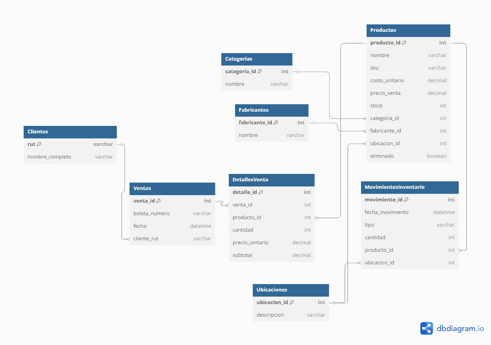

# Lubricentro ETL, CRUD y Análisis

Este proyecto implementa un flujo completo de gestión y análisis de datos para un lubricentro, usando dos bases de datos PostgreSQL: una **transaccional** (operativa) y otra **estrella** (analítica/dimensional). Incluye scripts para poblar datos, migrar (ETL), análisis y una interfaz gráfica CRUD.

---

## 1. Flujo General del Proyecto

1. **Base Transaccional**:
   - Aquí se gestionan los datos operativos (productos, ventas, stock, etc).
   - Puedes poblarla con datos de prueba usando el script `src/inserts_relacional.py` o la GUI.

2. **ETL**:
   - Migra los datos desde la base transaccional a la base estrella (dimensional) para análisis.
   - Ejecuta el script `src/etl.py` para realizar la migración.

3. **Base Estrella (Dimensional)**:
   - Aquí se almacenan los datos ya transformados y listos para análisis y reportes.

4. **Análisis y Reportes**:
   - Ejecuta `src/main.py <año>` para generar gráficos y reportes automáticos sobre la base estrella.

5. **Interfaz CRUD (GUI)**:
   - Ejecuta `src/gui.py` para gestionar productos, categorías, fabricantes, ubicaciones, etc.
   - La GUI opera sobre la base transaccional.

---

## 2. Prerrequisitos

- **Python 3.10+**
- **Git**
- **PostgreSQL** (servidor instalado y corriendo)

---

## 3. Configuración del Entorno

### 3.1. Clonar el Repositorio

```bash
git clone https://github.com/darkanthem21/trabajo_bd.git
cd trabajo_bd
```

### 3.2. Crear y Activar Entorno Virtual

```bash
python -m venv .venv
source .venv/bin/activate
```

### 3.3. Instalar Dependencias

```bash
pip install -r requirements.txt
```

### 3.4. Configurar Variables de Entorno

Crea un archivo `.env` en la raíz del proyecto con la siguiente estructura (ajusta los valores según tu entorno):

```ini
# Base de datos transaccional (operativa)
DB_TRANS_NAME=nombre_base_transaccional
DB_TRANS_USER=usuario
DB_TRANS_PASS=clave
DB_TRANS_HOST=localhost
DB_TRANS_PORT=5432

# Base de datos estrella (analítica)
DB_STAR_NAME=nombre_base_estrella
DB_STAR_USER=usuario
DB_STAR_PASS=clave
DB_STAR_HOST=localhost
DB_STAR_PORT=5432
```

---

## 4. Configuración de las Bases de Datos PostgreSQL

### 4.1. Crear Usuario y Bases de Datos

Conéctate a PostgreSQL como superusuario:

```bash
sudo -u postgres psql
```

2.  **Crea el usuario y las dos bases de datos** (transaccional y estrella):

```sql
CREATE USER tu_usuario WITH PASSWORD 'tu_clave';
CREATE DATABASE lubricentro_db_transaccional OWNER tu_usuario;
CREATE DATABASE lubricentro_db_estrella OWNER tu_usuario;
```

Otorga privilegios si es necesario:

```sql
GRANT ALL ON SCHEMA public TO tu_usuario;
```

Sal de `psql` con `\q`.

### 4.2. Crear Esquema de Tablas

- **Para la base transaccional:**
  Conéctate y ejecuta el script de creación de tablas relacionales:
  ```bash
  psql -U tu_usuario -d lubricentro_db_transaccional -h localhost
  \i sql/crear_base_relacional.sql
  ```

- **Para la base estrella:**
  Conéctate y ejecuta el script de creación de tablas dimensionales:
  ```bash
  psql -U tu_usuario -d lubricentro_db_estrella -h localhost
  \i sql/crear_base_estrella.sql
  ```

---

## 5. Uso del Proyecto

### 5.1. Poblar la Base Transaccional

```bash
python src/inserts_relacional.py
```
Esto llenará la base transaccional con datos de prueba.

### 5.2. Usar la Interfaz CRUD (GUI)

```bash
python src/gui.py
```
La GUI permite gestionar productos, categorías, fabricantes, ubicaciones, etc.
**Opera sobre la base transaccional.**

### 5.3. Migrar Datos a la Base Estrella (ETL)

```bash
python src/etl.py
```
Esto migra los datos desde la base transaccional a la estrella para análisis.

### 5.4. Ejecutar Análisis y Reportes

```bash
python src/main.py <anio>
```
Esto genera gráficos y reportes automáticos para el año ingresado.
Los gráficos se guardan en la carpeta `output/`.

---

## 6. Diagramas de la Base de Datos




---
