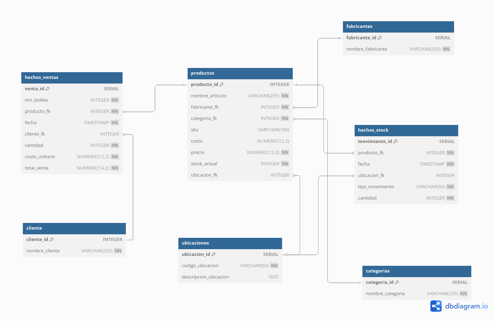

# Análisis de Datos para Lubricentro "LUBRI-EXPRESS"

## Enunciado

- Se quiere modelar una base de datos para un Lubricentro. Se debe registrar la informacion de cada producto, incluyendo su nombre, SKU, costro, precio, strock actual y su ubicacion en bodega. Cada producto se relaciona con una categoria y un fabricante determinados. Las categorias clasifican los productos por tipo (Bebidas, Aceites, Aditivos, etc), mientras que los fabricantes identifican la empresa proveedora de cada articulo.

* Cada producto se encuentra asociado a una ubicacion fisica (bodega).

* Para controlar los movimientos del inventario se registra la fecha, cantidad, producto involucrado, su ubicacion y el tipo de movimiento. Los movimientos de stock tambien estan referenciados a ubicaciones especificas.

* Los movimientos de stock, como ingresos, salidas u otros tipos, guardansu fecha de movimiento, la cantidad, el producto que se esta moviendo, su ubicacion y el tipo de movimiento realizado.

* Se requiere mantener un registro de los clientes, incluyendo su identificación (RUT) y nombre, para luego asociarlos a las transacciones de venta.

* Cada venta incluye datos como el numero de boleta, fecha, producto vendido, cliente, cantidad, precio unitario y total de la transacción. Estas ventas están relacionadas directamente con los clientes y productos involucrados.

## 1. Funcionamiento

El programa principal (`src/main.py`) permite generar los siguientes análisis para un año determinado:

* Ventas totales por mes.
* Top 5 productos más vendidos (por cantidad).
* Ventas totales por categoría de producto.
* Faltan otras 6 (**PENDIENTEEEEE**)

Los resultados de cada análisis se guardan como imágenes PNG en la carpeta `output/`.

## 2. Prerrequisitos

* **Python**
* **Git**
* **PostgreSQL** (Servidor instalado y corriendo)

## 3. Configuración del Entorno

### 3.1. Clonar el Repositorio
```bash
git clone https://github.com/darkanthem21/trabajo_bd.git
cd trabajo_bd
```

### 3.2. Configurar Entorno Virtual y Dependencias de Python
Se recomienda encarecidamente utilizar un entorno virtual.

1.  **Crear Entorno Virtual** (dentro de la carpeta raíz `trabajo_bd/`):
    ```bash
    python -m venv .venv
    ```
2.  **Activar Entorno Virtual**:
    ```bash
    source .venv/bin/activate
    ```

3.  **Instalar Dependencias**:
    ```bash
    pip install -r requirements.txt
    ```

### 3.3. Configurar Variables de Entorno
1.  Copia el archivo `.env_example` a un nuevo archivo llamado `.env` en la raíz del proyecto:
    ```bash
    cp .env_example .env
    ```

2.  Abre el archivo `.env` con un editor de texto y modifica las variables
    ```ini
    DB_NAME="lubricentro_db"
    DB_USER="tu_usuario_postgres"
    DB_PASS="tu_contraseña_postgres"
    DB_HOST="localhost"
    DB_PORT="5432"
    ```

## 4. Configuración de la Base de Datos PostgreSQL

### 4.1. Crear Usuario y Base de Datos en PostgreSQL
1.  **Conéctate a PostgreSQL como superusuario** :
    ```bash
    sudo -u postgres psql
    ```

2.  **Crea el Rol (Usuario)**
    ```sql
    CREATE USER <tu_usuario_postgres> WITH PASSWORD '<tu_contraseña_postgres>';
    ```

3.  **Crea la Base de Datos**
    ```sql
    CREATE DATABASE lubricentro_db OWNER <tu_usuario_postgres>;
    ```

4.  **Conéctate a la Nueva Base de Datos** (aún como superusuario `postgres` o un usuario con permisos) para otorgar privilegios:
    ```sql
    \c lubricentro_db
    ```
    Otorga todos los privilegios sobre el esquema `public` al usuario del proyecto:
    ```sql
    GRANT ALL ON SCHEMA public TO <tu_usuario_postgres>;
    ```

5.  **Sal de `psql`**:
    ```sql
    \q
    ```

### 4.2. Crear Esquema de Tablas
1.  **Conéctate a tu base de datos** con el usuario que creaste para el proyecto:
    ```bash
    psql -U tu_usuario_de_bd -d lubricentro_db -h localhost
    # Reemplaza tu_usuario_de_bd por el valor de DB_USER en tu .env
    ```
    Se te pedirá la contraseña que estableciste para este usuario.

2.  **Ejecuta el script SQL para crear las tablas**:
    ```sql
    \i sql/crear_basev2.sql
    ```

3.  **Verifica las tablas creadas** (opcional):
    ```sql
    \dt
    ```

4.  **Sal de `psql`**:
    ```sql
    \q
    ```

### 4.3. Poblar la Base de Datos con Datos de Prueba
1.  Asegúrate de estar en el directorio raíz del proyecto (`trabajo_bd/`) y que tu entorno virtual esté activado.
2.  Ejecuta el script de inserción:
    ```bash
    python src/inserts.py
    ```
    Esto llenará las tablas con datos ficticios para los años definidos en el script (por defecto 2023-2025) Se pueden alterar los parametros  `src/inserts.py`. (anio, nro de fabricantes, etc)

## 5. Uso del Programa de Análisis

### 8.1. Ejecutar el Análisis
Para generar los informes y gráficos:

1.  Asegúrate de estar en el directorio raíz del proyecto (`trabajo_bd/`).
2.  Asegúrate de que tu entorno virtual (`.venv`) esté activado.

3.  Ejecuta el script `src/main.py` pasando el año que deseas analizar como argumento:
    ```bash
    python src/main.py <año>
    ```
    Por ejemplo, para analizar el año 2024:
    ```bash
    python src/main.py 2024
    ```

### 8.2. Salida
**REVISAR  `trabajo_bd/output`)**
## 9. Diagrama de la Base de Datos




---
